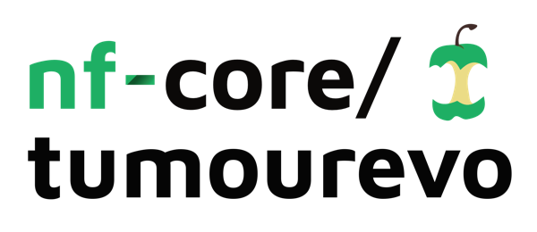
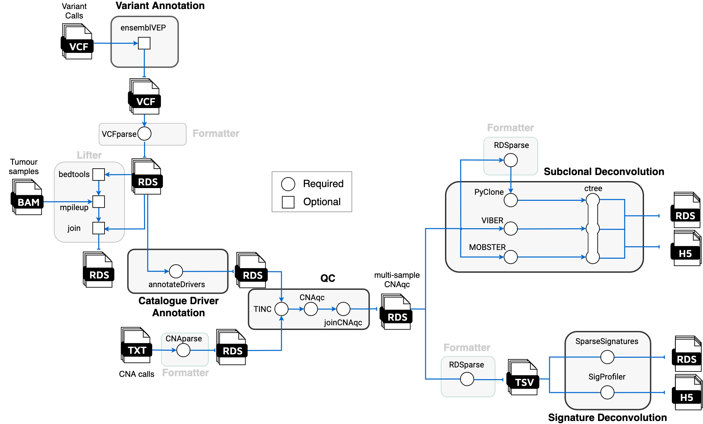

<h1>
  <picture>
    <source media="(prefers-color-scheme: dark)" srcset="docs/images/nf-core-tumourevo_logo_dark.png">
    
  </picture>
</h1>

[](https://github.com/nf-core/tumourevo/actions/workflows/ci.yml)
[](https://github.com/nf-core/tumourevo/actions/workflows/linting.yml)[](https://nf-co.re/tumourevo/results)[](https://doi.org/10.5281/zenodo.XXXXXXX)
[](https://www.nf-test.com)

[](https://www.nextflow.io/)
[](https://docs.conda.io/en/latest/)
[](https://www.docker.com/)
[](https://sylabs.io/docs/)
[](https://cloud.seqera.io/launch?pipeline=https://github.com/nf-core/tumourevo)

[](https://nfcore.slack.com/channels/tumourevo)[](https://twitter.com/nf_core)[](https://mstdn.science/@nf_core)[](https://www.youtube.com/c/nf-core)

## Introduction

**nf-core/tumourevo** is a bioinformatics pipeline to model tumour evolution from whole-genome sequencing (WGS) data. The pipeline performs state-of-the-art downstream analysis of variant and copy-number calls from tumour-normal matched sequecing assays, reconstructing the evolutionary processes leading to the observed tumour genome. This analysis can be done at the level of single samples, multiple samples from the same patient (multi-region/longitudinal assays), and of multiple patients from distinct cohorts.

The pipeline is built using [Nextflow](https://www.nextflow.io), a workflow tool to run tasks across multiple compute infrastructures in a very portable manner.
It comes with docker containers making installation trivial and results highly reproducible. The [Nextflow DSL2](<[https://www.nextflow.io](https://www.nextflow.io/docs/latest/dsl1.html)>)
implementation of this pipeline uses one container per process which makes it easier to maintain and update software dependencies. Where possible, these processes have been submitted to and
installed from [nf-core/modules](https://github.com/nf-core/modules) in order to make them available to all nf-core pipelines, and to everyone within the Nextflow community!

## Pipeline Summary

The tumourevo pipeline supports variant annotation, driver annotation, quality control processes, subclonal deconvolution and signature deconvolution analysis through various tools.
It can be used to analyse both single sample experiments and longitudinal/multi-region assays, in which multiple samples of the same patient are avaiable.
As input, you must provide at least information on the samples, the VCF file from one of the supported callers and the output of one of the supported copy number caller.
By default, if multiple samples from the same patient are provided, they will be analysed in a multivariate framework (which affects in particular the subclonal deconvolution deconvolution steps)
to retrieve information useful in the reconstruction of the evolutionary process. Depending on the variant calling strategy (single sample or multi sample) and the provided input files,
different strategies will be applied.

<p align="center">
    
</p>

- Quality Control (`CNAqc`, `TINC`)
- Variant Annotation (`VEP`, `maftools`)
- Driver Annotation (`SOPRANO`, `dndsCV`)
- Subclonal Deconvolution (`PyClone`, `MOBSTER`, `VIBER`)
- Clone Tree Inference (`ctree`)
- Signature Deconvolution (`SparseSignatures`, `SigProfiler`)
- Genome Interpreter

## Usage

> [!NOTE]
> If you are new to Nextflow and nf-core, please refer to [this page](https://nf-co.re/docs/usage/installation) on how to set-up Nextflow. Make sure to [test your setup](https://nf-co.re/docs/usage/introduction#how-to-run-a-pipeline) with `-profile test` before running the workflow on actual data.

First, prepare a samplesheet with your input data that looks as follows:

`samplesheet.csv`:

```csv
dataset,patient,sample,normal_sample,vcf,vcf_tbi,cna_segments,cna_extra,cna_caller,cancer_type
dataset1,patient1,S1,N1,patient1_S1.vcf.gz,patient1_S1.vcf.gz.tbi,/CNA/patient1/S1/segments.txt,/CNA/patient1/S1/purity_ploidy.txt,caller,PANCANCER
dataset1,patient1,S2,N1,patient1_S1.vcf.gz,patient1_S1.vcf.gz.tbi,/CNA/patient1/S2/segments.txt,/CNA/patient1/S2/purity_ploidy.txt,caller,PANCANCER
```

-->

Now, you can run the pipeline using:

<!-- TODO nf-core: update the following command to include all required parameters for a minimal example -->

```bash
nextflow run nf-core/tumourevo \
   -profile <docker/singularity/.../institute> \
   --input samplesheet.csv \
   --outdir <OUTDIR> \
   --genome GRCh37
```

> [!WARNING]
> Please provide pipeline parameters via the CLI or Nextflow `-params-file` option. Custom config files including those provided by the `-c` Nextflow option can be used to provide any
> configuration _**except for parameters**_; see [docs](https://nf-co.re/docs/usage/getting_started/configuration#custom-configuration-files).

For more details and further functionality, please refer to the [usage documentation](https://nf-co.re/tumourevo/usage) and the [parameter documentation](https://nf-co.re/tumourevo/parameters).

## Pipeline output

To see the results of an example test run with a full size dataset refer to the [results](https://nf-co.re/tumourevo/results) tab on the nf-core website pipeline page.
For more details about the output files and reports, please refer to the
[output documentation](https://nf-co.re/tumourevo/output).

## Credits

nf-core/tumourevo was originally written by Nicola Calonaci, Elena Buscaroli, Katsiaryna Davydzenka, Giorgia Gandolfi, Virginia Gazziero, Brandon Hastings, Davide Rambaldi, Rodolfo Tolloi, Lucrezia Valeriani and Giulio Caravagna.

The nf-core/tumourevo pipeline comes with documentation about the pipeline, found in the `docs/` directory:

1. [Installation](https://nf-co.re/usage/installation)
2. Pipeline configuration
   - [Local installation](https://nf-co.re/usage/local_installation)
   - [Adding your own system config](https://nf-co.re/usage/adding_own_config)
   - [Reference genomes](https://nf-co.re/usage/reference_genomes)
3. [Running the pipeline](docs/usage.md)
4. [Output and how to interpret the results](docs/output.md)
5. [Troubleshooting](https://nf-co.re/usage/troubleshooting)

<!-- TODO nf-core: Add a brief overview of what the pipeline does and how it works -->

## Contributions and Support

If you would like to contribute to this pipeline, please see the [contributing guidelines](.github/CONTRIBUTING.md).

For further information or help, don't hesitate to get in touch on the [Slack `#tumourevo` channel](https://nfcore.slack.com/channels/tumourevo) (you can join with [this invite](https://nf-co.re/join/slack)).

## Citations

<!-- TODO nf-core: Add citation for pipeline after first release. Uncomment lines below and update Zenodo doi and badge at the top of this file. -->
<!-- If you use nf-core/tumourevo for your analysis, please cite it using the following doi: [10.5281/zenodo.XXXXXX](https://doi.org/10.5281/zenodo.XXXXXX) -->
<!-- TODO nf-core: Add bibliography of tools and data used in your pipeline -->

An extensive list of references for the tools used by the pipeline can be found in the [`CITATIONS.md`](CITATIONS.md) file.

You can cite the `nf-core` publication as follows:

> **The nf-core framework for community-curated bioinformatics pipelines.**
>
> Philip Ewels, Alexander Peltzer, Sven Fillinger, Harshil Patel, Johannes Alneberg, Andreas Wilm, Maxime Ulysse Garcia, Paolo Di Tommaso & Sven Nahnsen.
>
> _Nat Biotechnol._ 2020 Feb 13. doi: [10.1038/s41587-020-0439-x](https://dx.doi.org/10.1038/s41587-020-0439-x).
